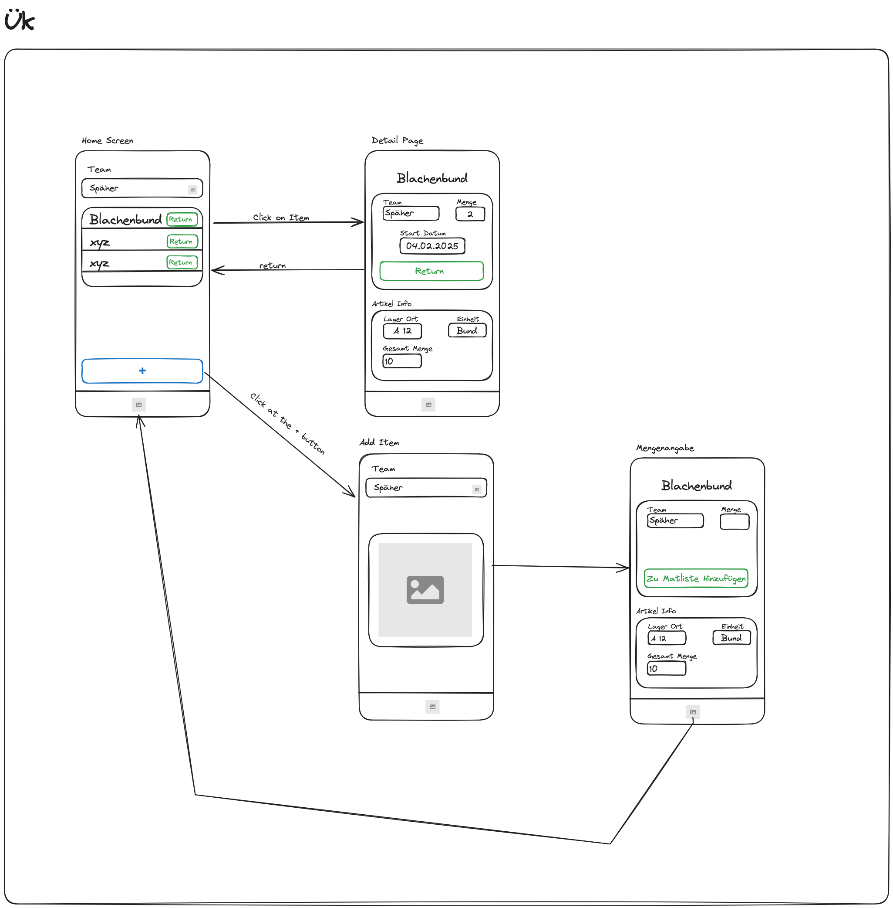

# ÜK 335

Im ÜK 335 ging es darum eine eigene Mobile App zu entwickeln. Ich hatte gemischte Gefühle bezüglich diesem ÜK, auf der einen Seite freute ich mich sehr. Ich wollte schon seit langem mir mal die Zeit nehmen um mich mit der Entwicklung von Mobile Apps auseinander zu setzen und jetzt wurde mir die Möglichkeit geboten.  
Jedoch habe ich von Freunden aus der Klasse auch schon viel Negatives über diesen Kurs gehört, er sei sehr stressig, habe viel zu grosse Aufgaben für nur eine Woche, vor allem da das Projekt bewertet wird für das man insgesamt nur drei Tage Entwicklungszeit hat.  
Denn in diesem ÜK wird einem nicht nur das Entwickeln beigebracht sondern auch 
wie man die Ideenfindung dokumentiert, Projektdefinitionen schreibt, Architektur plant usw.
Jedoch kann ich im Nachhinein sagen das ich es ein extrem toller ÜK gefunden habe, mit einem sehr tollen Lehrer. 

Etwas was für uns neu war, ist der Fakt das wir selbst aussuchen konnten was für eine Programmiersprache wir nehmen wollten, zur Verfügung standen: Flutter/ React Native und Android Studio. Normalerweise hatte man diese Möglichkeit nicht, jedoch wollten sie uns damit das Entscheidungsraster und andere Dokumentationstechniken für die IPA beibringen. 

Ich habe mich dann schlussendlich zusammen mit Yanis und ein paar anderen an unserem Tisch für Flutter entschieden. 

## Was ist Flutter und warum habe ich es gewählt?

Flutter ist ein Framework von Google mit dem man Apps für verschiedene Plattformen entwickeln kann. Es wurde 2017 von Google rausgebracht und ist seitdem sehr beliebt geworden für die Entwicklung von Mobile Apps.

### Meine Entscheidung für Flutter

**Warum nicht Android Studio?**
Android Studio war für mich von Anfang an ausgeschlossen da ich zurzeit noch ein Windows hatte jedoch nur ein iPhone. Heisst ich hatte die Möglichkeit gar nicht eine iOS-Applikation zu machen und ein Android hätte ich nicht nutzen können deshalb habe ich das schnell ausgeschlossen. 

**Flutter vs React Native**
Deshalb kam nur noch Flutter oder React Native in Frage. Ich wusste das wir für Netgrade z.B. React Native nutzen und wollte deshalb eigentlich zuerst eine App damit machen jedoch hat unsere Lehrperson dann ein wenig geschwärmt von Flutter und in ihrem enthusiastischen Erzählen mich mitgerissen. 
Zusätzlich kommt noch das zumindest laut ChatGPT Flutter für mehr Plattformen möglich ist, fast die gleiche Performance hat wie Native Apps und man weniger Native Module braucht. Deshalb habe ich mich dann mit ein paar anderen aus meiner Klasse für Flutter entschieden.

### Was macht Flutter so besonders?

#### 1. **Dart als Programmiersprache**
Flutter nutzt Dart als Programmiersprache, die auch von Google entwickelt wurde. Dart ist objektorientiert und ähnelt Java und C#. Was ich besonders cool finde ist das man durch die Ahead-of-Time Kompilierung sehr gute Performance bekommt und das Hot Reload Feature macht die Entwicklung super schnell.

#### 2. **Cross-Platform Development**
Das bedeutet man kann mit einer Codebase Apps für iOS, Android, Web und Desktop machen. Das finde ich echt praktisch weil man nicht für jede Plattform extra entwickeln muss. Die Performance ist dabei fast so gut wie bei nativen Apps.

#### 3. **Widget-basierte Architektur**
In Flutter ist alles ein Widget. Das klingt erstmal komisch aber es macht die Entwicklung sehr flexibel. Man kann einfache Widgets zu komplexen UIs zusammenbauen. Es gibt sowohl Material Design als auch Cupertino Widgets zur Verfügung.

#### 4. **Hot Reload**
Das ist mein Lieblingsfeature! Man kann Änderungen sofort sehen ohne die App neu zu starten. Das macht die Entwicklung viel schneller und man behält den App-Zustand bei.

### Warum ist Flutter so gut?

#### **Performance**
Die Performance ist fast so gut wie bei nativen Apps weil der Code direkt kompiliert wird. Man bekommt 60 FPS Rendering und eine optimierte GPU-basierte Rendering-Engine.

#### **Entwicklungsgeschwindigkeit**
Durch Hot Reload kann man sehr schnell entwickeln. Man hat eine einheitliche Codebase für alle Plattformen und eine riesige Widget-Bibliothek zur Verfügung.

#### **Konsistenz**
Die Apps sehen und verhalten sich auf allen Plattformen gleich. Das bedeutet weniger plattformspezifische Bugs und eine einheitliche Entwicklererfahrung.

#### **Community und Ecosystem**
Es gibt eine riesige, aktive Community. Es gibt viele Pakete und Plugins und die Dokumentation ist sehr gut.

### Flutter vs. React Native

| Aspekt | Flutter | React Native |
|--------|---------|--------------|
| **Sprache** | Dart | JavaScript/TypeScript |
| **Performance** | Nahezu native | JavaScript Bridge |
| **Hot Reload** | Sehr schnell | Langsamer |
| **Native Modules** | Weniger benötigt | Mehr erforderlich |
| **Plattform-Support** | iOS, Android, Web, Desktop | iOS, Android, Web |
| **Lernkurve** | Steiler (Dart lernen) | Flacher (JavaScript) |

## Projekt-Dokumentation

### Projektidee
Wir bekamen verschiedene Anforderungen, man musste eine gewisse Anzahl Punkte holen und jede Anforderung hat andere Punkte gegeben. So musste man z.B. eine Applikation bauen die 12 Punkte wert ist. Hat man dann Sensoren eingebaut hat das eine gewisse Anzahl Punkte gegeben.

Ich wollte aber nicht nur eine App bauen die die Punkte erfüllt und gut ist sondern die ich auch privat nutzen könnte. Deshalb habe ich mich für eine Inventory App entschieden. 

In meiner Freizeit bin ich tätig in der [Jungschar Wetzikon](https://jungschi.ch/). Wir haben viel Material das wir an Jungschi-Nachmittage nutzen, um nun zu wissen wer was wann genutzt hat oder noch nutzen wird, müssen wir repetierende Materiallisten führen. 95% der Arbeit ist nur zu notieren was für ein Artikel es ist und wo er im Lager ist. Alles Informationen die man automatisieren kann. 
Wir haben auch schon etwa 90% von allem Material in einer Excel-Liste erfasst, mit Standort und Mengenangaben. 
Das ist auch der Grund wie ich auf die Idee gekommen bin eine Applikation zu machen bei der man QR-Codes scannen kann und dann erfasst es einem alle Angaben automatisch. Man muss danach nur noch angeben wie viel und bis wann man es nutzen will, der Rest wäre schon ausgefüllt. 

Zusätzlich wollte ich das man Infos von den Artikeln bekommen kann und das man sie zurück geben kann. 

### App-Flow und Benutzeroberfläche


Das ist mal ein App Mock von mir, den ich im ÜK gemacht habe. Das Ziel ist das wenn man auf das + drückt man auf einen QR-Scanner kommt und das Team aussuchen kann und danach alles automatisch gemacht wird. Am Schluss müsste man dann nur noch die Mengenangabe machen und der Rest wäre gemacht. 

### Zielgruppe
Meine Zielgruppe sind hauptsächlich Leiter und Helfer der Jungschar Wetzikon. Das sind meist Jugendliche und junge Erwachsene die regelmässig Material für Jungschi-Nachmittage ausleihen und zurückgeben müssen. Sie brauchen eine einfache und schnelle Lösung um Material zu verwalten ohne viel Zeit mit Listen zu verbringen.

### Funktionen
- **QR-Code Scanner**: Automatisches Erfassen von Material durch QR-Code-Scan
- **Team-Auswahl**: Auswahl des Teams das das Material nutzt
- **Automatische Datenbankabfrage**: Alle Materialinfos werden automatisch aus der Excel-Datenbank geladen
- **Mengenangabe**: Einfache Eingabe der benötigten Menge
- **Material-Rückgabe**: Funktion um Material als zurückgegeben zu markieren
- **Material-Info**: Anzeige von Lagerort, Gesamtmenge und Einheit

### Technische Architektur
Als Backend habe ich eine NextJS-Applikation mit einer Prisma-Datenbank gemacht die die Basis-Requests handeln kann und danach habe ich es auf Vercel deployed damit meine App darauf zugreifen kann.

### Herausforderungen und Lösungen
**QR-Code Integration**: Das war für mich neu und ich musste erst lernen wie man QR-Codes in Flutter implementiert. Die Lösung war das `qr_code_scanner` Paket zu nutzen.

**Flutter Einarbeitung**: Generell war für mich schwierig mich mit Flutter zurecht zu finden und auch alles in dieser kurzen Zeit hinzubekommen aber es hat mir Freude gemacht mich damit auseinander zu setzen.

**State Management**: Das war für mich erstmal verwirrend aber ich habe mich für Provider entschieden weil es einfach zu verstehen ist.

### Lernerfolge
Ich habe gelernt wie man QR-Codes in Flutter implementiert und gelernt wie man Backends auf Vercel deployed. Das State Management war für mich neu und ich verstehe jetzt besser wie man Daten in Apps verwaltet. Flutter hat mir gezeigt wie man schnell und effizient cross-platform Apps entwickelt.

### Meine App
**⚠️ Hinweis: Diese App ist outdated und wurde nur für den ÜK entwickelt**

Du kannst dir meine App hier anschauen: [Inventory Manager App ÜK Version](https://ninisigi.github.io/appStore_html_page/)

Die App zeigt die grundlegende Funktionalität die ich geplant hatte, ist aber noch nicht vollständig implementiert da wir nur 3 Tage Entwicklungszeit hatten.

**⚠️ Ich werde diese App noch einmal umbauen und als PWA entwickeln da dies auf allen Geräten ohne App Store funktioniert: [Inventory Manager PWA](https://inventory-manager-feg.de/)**

## Flutter Grundlagen

### Widget-Hierarchie
So sieht eine typische Flutter App aus:
```dart
MaterialApp(
  home: Scaffold(
    appBar: AppBar(
      title: Text('Meine App'),
    ),
    body: Center(
      child: Text('Hallo Flutter!'),
    ),
  ),
)
```

### State Management
Das war für mich erstmal verwirrend aber es gibt verschiedene Arten:
- **StatelessWidget**: Für UI-Komponenten ohne Zustand
- **StatefulWidget**: Für UI-Komponenten mit veränderlichem Zustand
- **Provider/Riverpod**: Für komplexes State Management
- **Bloc**: Für Business Logic Component Pattern

### Navigation
So navigiert man zu einer neuen Seite:
```dart
// Navigation zu einer neuen Seite
Navigator.push(
  context,
  MaterialPageRoute(builder: (context) => SecondPage()),
);
```

### Asynchrone Programmierung
Das ist wichtig für API-Calls und so:
```dart
// Future und async/await
Future<String> fetchData() async {
  final response = await http.get(Uri.parse('https://api.example.com/data'));
  return response.body;
}
```

## Fazit

Flutter hat sich als echt gute Wahl für mein erstes Mobile-App-Projekt rausgestellt. Die Kombination aus schneller Entwicklung, guter Performance und der Möglichkeit für mehrere Plattformen zu entwickeln macht Flutter zu einem echt mächtigen Werkzeug für moderne App-Entwicklung.


