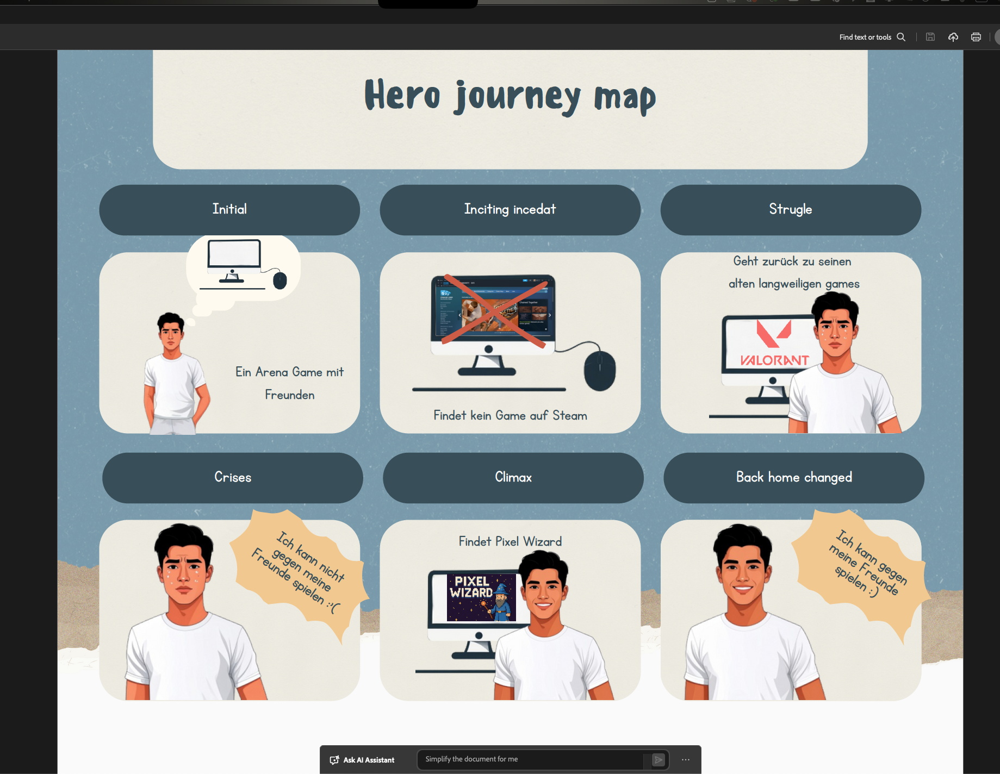
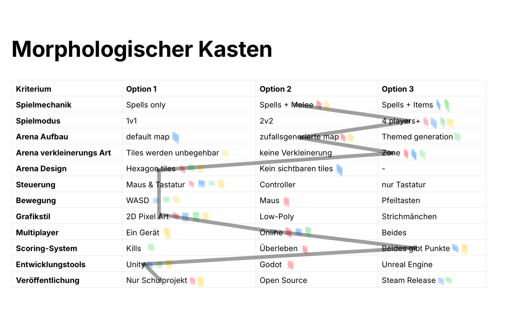
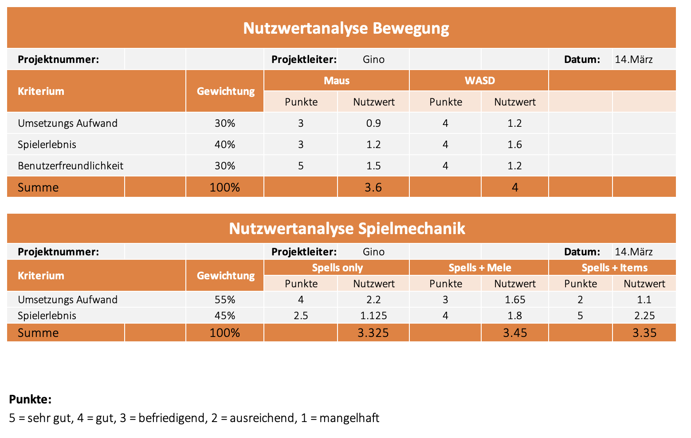
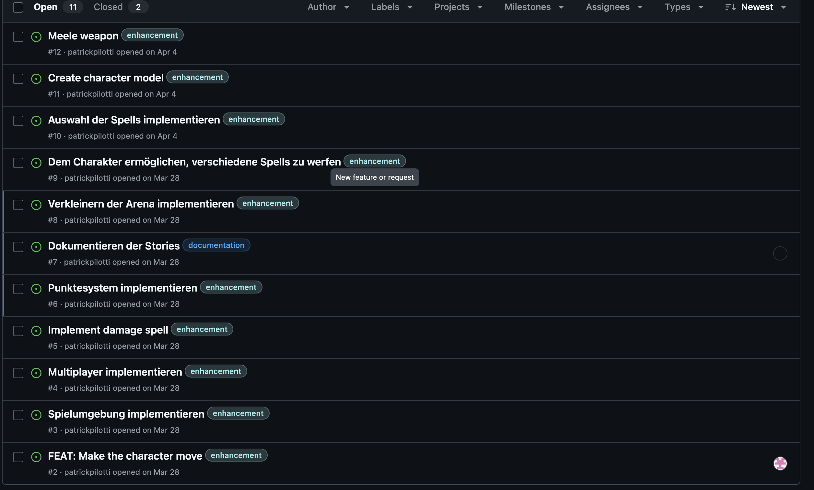
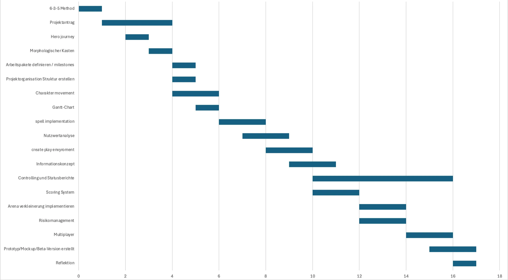

# Pixel Wizard - Arena Game

Im Rahmen eines Schulprojekts habe ich zusammen mit Gino (Projektmanager), Ewan (Senior Dev) und Patrick (Head of Security) ein **Multiplayer Arena-Game** entwickelt. Das war für mich eine super spannende Erfahrung weil ich dabei nicht nur Unity gelernt habe, sondern auch viel über Teamarbeit und Projektmanagement.

## Was ist Pixel Wizard?

Pixel Wizard ist ein **2D Arena-Game** das man mit Freunden online spielen kann. Die Idee kam uns durch die Hero Journey - ein Spieler der frustriert ist weil er kein gutes Multiplayer-Spiel findet das er mit seinen Freunden spielen kann.

**Wichtig:** Das Ziel war nicht ein vollständig funktionales, verkaufsfertiges Spiel zu entwickeln. Es ging vielmehr um ein **Konzeptprojekt** bei dem wir lernen sollten wie man systematisch an die Entwicklung eines Spiels herangeht. Der Fokus lag auf **Projektmanagement**, **Teamarbeit** und dem **Entwicklungsprozess** selbst.

### Aktueller Stand

**Was funktioniert schon:**
- Multiplayer mit Lobby System
- Spell casting (Zauber wirken)
- Player Movement (Spieler Bewegung)
- Map Design
- Interagierbare Map Teile

**Was noch fehlt:**
- Scoring System
- Verkleinerung der Arena
- Ausführliches Testing (da gibt's sicher noch viele Bugs)

Aber ehrlich gesagt ist das völlig okay - wir haben ja auch nicht erwartet dass wir in ein paar Wochen ein fertiges Spiel hinbekommen. Das war nie das Ziel.

## Wie wir die Idee entwickelt haben

### 6-3-5 Methode für Ideenfindung

Wir haben mit der **6-3-5 Methode** angefangen um überhaupt eine Idee zu finden. Das war echt cool - jeder hat 3 Ideen aufgeschrieben, dann haben wir die Blätter weitergegeben und die nächste Person hat die Ideen weiterentwickelt.

Dabei kamen alle möglichen Ideen raus:
- Sprachlern-Apps
- Fitness-Apps 
- Vokabeltrainer
- Quiz-Apps
- Haushaltsbudget-Apps

Am Ende haben wir uns für ein **2D Video Spiel** entschieden weil das für alle am spannendsten war. Rückblickend war das vielleicht etwas ambitioniert, aber hey - man lernt ja auch aus Fehlern.

### Hero Journey - Warum Arena-Game?

Die Hero Journey hat uns geholfen zu verstehen **warum** unser Spiel wichtig ist:

1. **Problem:** Spieler sucht ein Arena-Game mit seinen Freunden
2. **Frustration:** Auf Steam findet er nichts Passendes
3. **Rückfall:** Er spielt alte Spiele wie Valorant, aber die machen keinen Spass mehr
4. **Krise:** "Ich kann nicht gegen meine Freunde spielen"
5. **Lösung:** Pixel Wizard - genau das was er gesucht hat!

Das war für mich eine neue Methode und hat mir geholfen zu verstehen wer unser Spiel eigentlich spielen soll. Auch wenn wir es nie so weit gebracht haben dass echte Spieler es testen konnten.

Den **morphologischen Kasten** kannte ich vorher nicht. Das ist eine coole Methode um systematisch Entscheidungen zu treffen. Wir haben für jeden Aspekt des Spiels verschiedene Optionen gesammelt und dann abgestimmt.

Ehrlich gesagt war das am Anfang etwas mühsam - so viele Optionen durchzugehen. Aber es hat uns geholfen wirklich über alle Möglichkeiten nachzudenken statt einfach das erste zu nehmen was uns eingefallen ist.

### Nutzwertanalyse

Wenn wir uns nicht einigen konnten haben wir die **Nutzwertanalyse** verwendet. Dabei gibst du verschiedenen Kriterien unterschiedliche Gewichtungen und rechnest dann aus welche Option am besten ist.

**Wichtige Entscheidungen:**
- **WASD Movement** statt Path Finding (4 vs 3.6 Punkte)
- **Spells + Melee** als Kampfsystem

Das war schon etwas nerdy, aber hat funktioniert. Am Ende hatten wir objektive Gründe für unsere Entscheidungen statt nur "das gefällt mir besser".

## Teamarbeit und Rollen

Was ich richtig gut fand war dass wir klare Rollen definiert haben:
- **Gino:** Projektmanager 
- **Nino:** Creative Director (ich)
- **Ewan:** Senior Dev
- **Patrick:** Head of Security

Das hat mega geholfen dass jeder wusste wofür er zuständig ist. Ich war für das ganze Design verantwortlich - von der Benutzeroberfläche bis zu den Characteren. Manchmal war das etwas frustrierend weil ich Ideen hatte die wir nicht umsetzen konnten, aber so ist das halt in einem Team.

### Kommunikation

Wir haben eine **Kommunikationsmatrix** erstellt die genau festlegt wer wann mit wem kommuniziert. Das war am Anfang etwas übertrieben aber hat uns echt geholfen den Überblick zu behalten.

Gerade bei so einem komplexen Projekt mit vier Leuten ist es wichtig dass alle wissen was läuft. Sonst arbeitet jeder vor sich hin und am Ende passt nichts zusammen.

**📋 [Projektsteckbrief (PDF)](./assets/Projektsteckbrief_Paganini_Siegrist_Hally_Pilotti.pdf)**

## Technische Umsetzung

### Projektstruktur

Wir haben das Projekt in **Arbeitspakete** aufgeteilt und diese als **Github Issues** verwaltet. Das war für mich neu aber sehr praktisch. So konnte jeder sehen was noch zu tun ist und wer woran arbeitet.

### Zeitplanung

Mit dem **Gantt-Chart** haben wir geplant wann welche Features fertig sein sollen. In der Realität hat dann alles länger gedauert als gedacht - das ist wohl normal bei Softwareprojekten.

Rückblickend waren wir ziemlich optimistisch was die Zeitplanung angeht. Aber das gehört zum Lernprozess dazu.

### Unity Multiplayer

Das war für mich das komplexeste Thema. Unity's Multiplayer-System ist nicht ganz einfach aber wenn man es mal verstanden hat ist es sehr mächtig. Wir haben es geschafft ein **Lobby System** zu implementieren wo sich Spieler treffen können.

Ich muss ehrlich sagen dass ich anfangs überhaupt nicht verstanden habe wie das funktioniert. Aber Ewan hat mir viel geholfen und nach ein paar Tutorials hat es dann Klick gemacht.

### Spell Casting System

Das **Spell Casting** war mein Lieblings-Feature zum Implementieren. Jeder Zauber hat verschiedene Eigenschaften und Effekte. Das Component-System von Unity macht es echt einfach neue Zauber zu erstellen.

Am Ende hatten wir nur ein paar basic Zauber, aber das Grundsystem funktioniert. Bei mehr Zeit hätten wir sicher noch coolere Effekte hinzugefügt.

## Herausforderungen und Learnings

### Was schwierig war

**Scope zu gross:** Wir haben uns zu viel vorgenommen für die Zeit die wir hatten. Ein Arena-Game mit Multiplayer ist halt schon ein ziemlich grosses Projekt. Aber das war uns am Anfang nicht so bewusst.

**Zu spät mit Planung angefangen:** Patrick hat recht - wir hätten früher mit der detaillierten Planung anfangen sollen. Die ersten Wochen haben wir etwas rumgegammelt und dann mussten wir am Ende hetzen.

**Balance zwischen Design und Funktionalität:** Als Creative Director wollte ich immer dass alles perfekt aussieht. Aber bei einem Prototyp ist es wichtiger dass es funktioniert. Das war für mich eine wichtige Erkenntnis.

**Verschiedene Skill-Level:** Nicht alle im Team hatten das gleiche Erfahrungslevel mit Unity. Das hat manchmal zu Frustration geführt, aber wir haben versucht uns gegenseitig zu helfen.

### Was ich gelernt habe

**Unity Multiplayer:** Das war komplett neu für mich. Jetzt verstehe ich wie man Lobby-Systeme macht und wie Netzwerk-Kommunikation in Spielen funktioniert. Das ist echt kompliziert aber auch faszinierend.

**Projektmethoden:** Die 6-3-5 Methode, morphologischer Kasten und Nutzwertanalyse sind super Tools für Projektplanung. Das werde ich definitiv wieder verwenden.

**Teamarbeit:** Klare Rollen und gute Kommunikation sind mega wichtig. Ohne das wäre das Chaos gewesen. Aber auch bei guter Planung ist es manchmal schwierig alle auf der gleichen Seite zu haben.

**Prioritäten setzen:** Bei einem Prototyp musst du unterscheiden zwischen "nice to have" und "must have". Das war für mich als Designer manchmal schwer zu akzeptieren.

**Realistische Einschätzung:** Wir haben uns definitiv zu viel vorgenommen. Das nächste Mal würde ich den Scope kleiner halten und dafür mehr in die Tiefe gehen.

## Aktueller Prototyp

[🎬 Video: Prototyp Demo](./assets/Mein_Film_3.mp4)

Unser aktueller Prototyp kann schon einiges:
- Multiplayer funktioniert (meistens)
- Spell casting ist implementiert
- Spieler können sich in der Arena bewegen
- Map Design ist fertig
- Interagierbare Objekte funktionieren

**Was noch fehlt:**
- Scoring System
- Arena soll sich verkleinern
- Viel Testing (da sind sicher noch Bugs drin)

Aber wie gesagt - das Ziel war ja auch nicht ein perfektes Spiel zu entwickeln. Es ging um den Lernprozess und da haben wir definitiv viel mitgenommen.

## Persönliche Reflexion

### Was gut lief

Ich bin stolz darauf was wir als Team erreicht haben. Das Multiplayer-System funktioniert und man kann schon richtig spielen (wenn auch nicht perfekt). Die systematische Planung mit all den Methoden hat uns geholfen nicht den Überblick zu verlieren.

Besonders cool war es zu sehen wie aus einer vagen Idee langsam etwas Konkretes wurde. Am Anfang war "Arena-Game" nur ein Wort, am Ende konnten wir tatsächlich zu viert in einer Arena gegeneinander kämpfen.

### Was ich anders machen würde

**Früher anfangen** mit der Planung - wir haben zu viel Zeit am Anfang verschwendet

**Kleinerer Scope** - lieber ein einfaches Spiel das perfekt funktioniert als ein komplexes das nur halb fertig ist

**Mehr Testing** von Anfang an - wir haben erst ganz am Ende richtig getestet

**Regelmässigere Team-Meetings** - manchmal haben wir wochenlang nicht richtig kommuniziert

**Bessere Aufgabenverteilung** - manchmal haben mehrere Leute an der gleichen Sache gearbeitet oder wichtige Aufgaben sind liegen geblieben

### Was ich mitgenommen habe

Das Projekt war eine mega gute Erfahrung. Ich habe nicht nur technisch viel gelernt (Unity, Multiplayer, C#) sondern auch im Projektmanagement und in der Teamarbeit.

Die verschiedenen Planungsmethoden werde ich definitiv in zukünftigen Projekten wieder verwenden. Besonders die 6-3-5 Methode für Ideenfindung und der morphologische Kasten für Entscheidungen.

Aber am wichtigsten war für mich zu lernen dass Softwareentwicklung ein iterativer Prozess ist. Du fängst mit einer Idee an, machst einen Prototyp, testest, verbesserst, und so weiter. Das ist kein linearer Prozess und das ist auch okay.

## Fazit

Pixel Wizard ist zwar noch nicht fertig aber schon ein spielbarer Prototyp. Das Wichtigste war für mich die Lernerfahrung - sowohl technisch als auch im Team. Unity Multiplayer ist echt komplex aber wenn man es einmal verstanden hat sehr mächtig.

Wenn ich ehrlich bin, bin ich ein bisschen enttäuscht dass wir nicht weiter gekommen sind. Aber gleichzeitig bin ich stolz auf das was wir geschafft haben. Wir haben in ein paar Wochen ein funktionierendes Multiplayer-System hinbekommen - das ist nicht nichts.

Das nächste Mal würde ich den Scope kleiner halten und mehr Zeit für Testing einplanen. Aber ich bin stolz auf das was wir erreicht haben und würde jederzeit wieder ein Spiel-Projekt machen.

**Was bleibt:** Ein halbfertiges Spiel, aber eine vollständige Lernerfahrung. Und das war ja auch das eigentliche Ziel.

---

:::info Hinweis zu den Ressourcen
Die Grafiken, PDFs und Videos in dieser Dokumentation stammen aus unserer ursprünglichen Projektdokumentation. Ich habe sie hier eingebunden um meine Lernerfahrungen zu illustrieren und damit andere nachvollziehen können, wie wir vorgegangen sind.
::: 